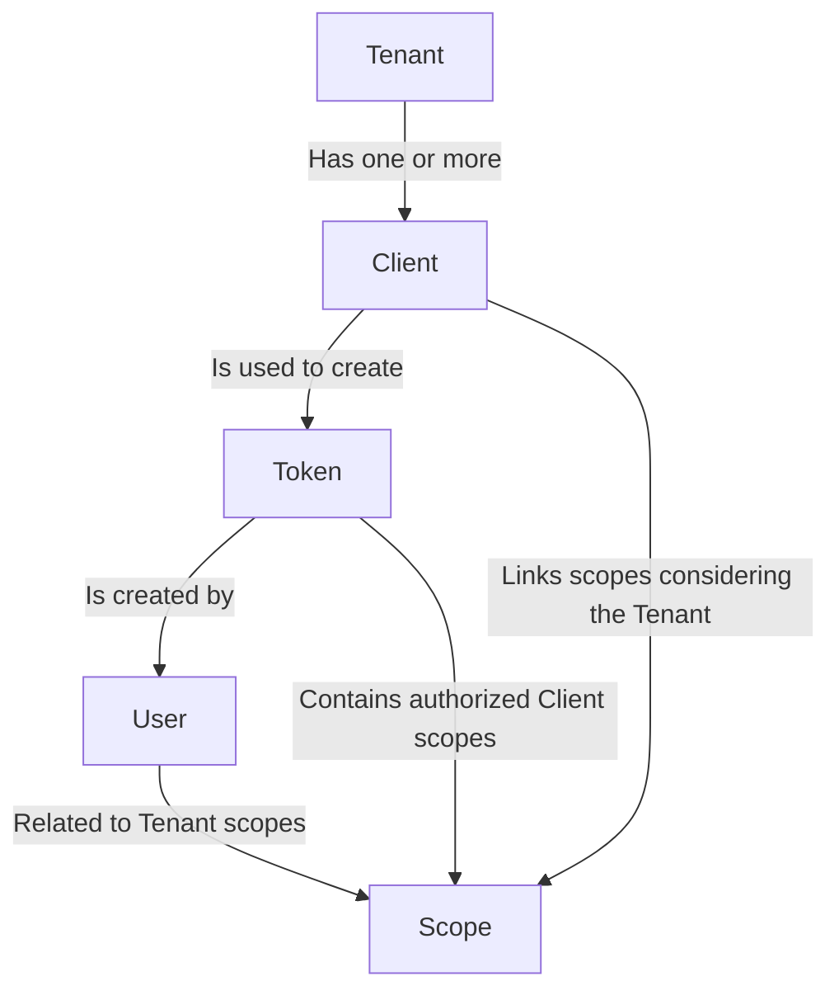
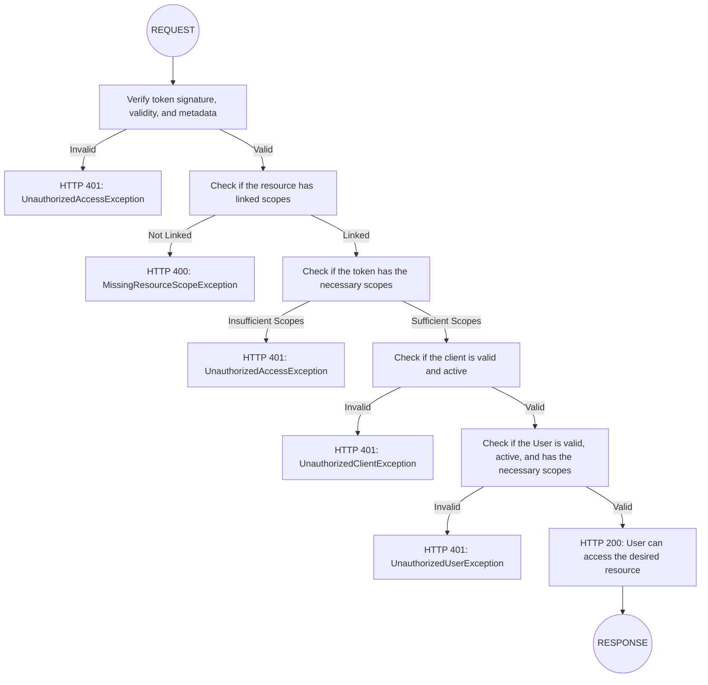

# hf-shield

A module for authentication and authorization management using OAuth 2.0, with robust support for
scope hierarchy and authentication flow.

## Table of Contents

1. [Introduction](#introduction)
2. [Installation](#installation)
3. [Configuration](#configuration)
4. [Translations](#translations)
5. [Defining Permissions](#defining-permissions)
6. [Creating migrations](#creating-migrations)

---

## Introduction

**hf-shield** is a module designed to facilitate the implementation of authentication and scope-based access control.
It follows the guidelines of the OAuth 2.0 protocol and is especially useful for distributed systems, multi-tenant
applications, and APIs that require complex permission hierarchies.

With customizable flows and well-defined validations, **hf-shield** offers a secure and scalable way to ensure
access to resources, with validations focused on tokens, users, and clients.

## Installation

Make sure your project uses PHP 8.2 or higher to ensure full compatibility.

To start using **hf-shield**, we suggest first installing `hyperf/hyperf-skeleton`.

```shell
composer create-project hyperf/hyperf-skeleton my-project
```

During installation, accept the following packages:

- Redis client: `hyperf/redis`
- Config Center: option 3 ETCD
- AMQP Component `hyperf/amqp`
- Elasticsearch component `hyperf/elasticsearch`

After installation, navigate to the project directory and install this module:

```bash
cd my-project
composer require jot/hf-shield
```

---

## Configuration

After installing the module, it needs to be configured. Make sure all dependencies are installed in your environment
before starting the service.

You can set up your development environment using the [docker-composer](./docker-compose.yml) in this
repository.

### Dependencies

#### ETCD

After installing the service in your environment, run the command below:

```shell
php bin/hyperf.php vendor:publish hyperf/etcd
```

#### REDIS

All cache management and rate-limiting are stored in Redis. After installing the service, run the command below:

```shell
php bin/hyperf.php vendor:publish hyperf/redis
```

With the configuration created, publish the credentials to ETCD with the following command:

```shell
php bin/hyperf.php etcd:put redis
``` 

#### ELASTICSEARCH

This application was built to use Elasticsearch as the main database.

```shell
php bin/hyperf.php vendor:publish jot/hf-elastic
```

After editing the `.env` file with the necessary credentials, register them in etcd:

```shell
php bin/hyperf.php etcd:put hf_elastic
``` 

#### SWAGGER

The code generation commands provided by the `jot/hf-repository` module already create controllers, entities, and
data repositories with the necessary Swagger basics, which means the application is born with documented APIs.

```shell
php bin/hyperf.php vendor:publish jot/hf-repository
```

#### RATE-LIMIT

Like Swagger, the `jot/hf-repository` module also implements the application's throttling configuration, which
can be configured globally and reimplemented on a case-by-case basis in controller methods through their
_annotations_.

```shell
php bin/hyperf.php vendor:publish hyperf/rate-limit
```

#### OAUTH2

Finally, add the configurations for this module to work:

```shell
php bin/hyperf.php vendor:publish jot/hf-shield
```

**Example of `config/autoload/hf_shield.php`:**

```php
return [
    'token_format' => 'JWT',            // token format. By default, JWT
    'private_key' => '',                // path or content of the private key
    'public_key' => '',                 // path or content of the public key
    'encryption_key' => '',             // string for data encryption
    'token_days' => 'P1D',              // token validity in PHP DateTimeInterval format
    'refresh_token_days' => 'P1M',      // refresh token validity in PHP DateTimeInterval format
    'revoke_user_old_tokens' => true,   // enables trigger that revokes previous user/client tokens
];
```

#### MIGRATIONS

After everything is configured, it's time to run the migrations so that the necessary indices for the authentication
process are created:

```shell
php bin/hyperf.php elastic:migrate
```

---

## Translations

**hf-shield** supports internationalization (i18n) using the hyperf/translation package. Translation files are located
in `storage/languages/{locale}/hf-shield.php`.

Currently, the module supports the following languages:

- English (en)
- Brazilian Portuguese (pt_BR)

To add support for a new language, create a new translation file following the existing pattern.

### Publishing Translations

Translations are automatically published when you run the package publish command:

```shell
php bin/hyperf.php vendor:publish hyperf/translation 
php bin/hyperf.php vendor:publish jot/hf-shield 
```

Additional packages translations will be automatically published when you publish the `hf-*` package.

eg:

```shell
php bin/hyperf.php vendor:publish jot/hf-elastic 
php bin/hyperf.php vendor:publish jot/hf-validator 
php bin/hyperf.php vendor:publish jot/hf-repository 
```

### Customizing Translations

You can customize translations by editing the files in `storage/languages/{locale}/messages.php`. Translation keys are
organized into the following categories:

- Command messages (for CLI)
- Form labels and prompts
- Exception messages

---

## Defining Permissions

### Scopes

Scopes are automatically implemented in controllers when created by the repo:controller or repo:crud command,
but if you are implementing a controller manually, add the following docblock before the desired action:

```php
#[Scope(allow: 'service:resource:permission')]
public function myAction(string $id): PsrResponseInterface {
   // ...
}
```

#### Scope Naming Rules

Scopes should be named following this pattern: `[service]:[resource]:[permission]`

Examples:

```
api-events:event:list
api-events:event:create
api-shopping:order:create
api-shopping:order:update
api-shopping:order:list
```

To register the scopes in the application, run the command below:

```shell
php bin/hyperf.php oauth:scope sync
```

### Token Validation

If you want your action to be protected by token, you must add the middleware with the desired validation strategy:

```php
#[Middleware(middleware: BearerStragegy::class)]
```

Currently, there are 3 types of strategies for request validation:

1. **BearerStrategy**, validates the token through the Authorization header: Bearer _{token}_, generated by the
   `/oauth/token` endpoint.
2. **SessionStrategy**, validates the token from the access_token cookie, generated by the '/oauth/session' endpoint,
   which
   encrypts the token and sends it to the browser cookies.
3. **SignedJwtStrategy**, validates the token by its signature. In this case, the payload is sent in the JWT and
   validated by
   the user's signature.

---

### API Validation Scope Hierarchy

The following diagram describes how the scope hierarchy works in **hf-shield**:



### Authentication Flow

The authentication flow expected by **hf-shield** is described in the diagram below:



---

## Creating migrations

Inspired by [Laravel](https://laravel.com) migrations, the [hf-elastic](https://github.com/JotJunior/hf-elastic) module,
part of the hf-shield ecosystem, allows you to create your indices quickly and dynamically, either manually or from JSON
examples or JSON Schemas, and is prepared for all known types of [Elasticsearch](https://elastic.co) in version 8.x.

### Creating a migration manually

```shell
php bin/hyperf elastic:migration my_awesome_index
```

As a result, it will create a file in the format `YYYYmmdd-create-my_awesome_index.php` in the
`migrations/elasticsearch` directory.

The generated file will be in this format:

```php
<?php

declare(strict_types=1);

use Hyperf\Context\ApplicationContext;
use Jot\HfElastic\Migration;
use Jot\HfElastic\Migration\Mapping;

return new class(ApplicationContext::getContainer()) extends Migration {

    public const INDEX_NAME = 'my_awesome_index';
    public bool $addPrefix = true;

    public function up(): void
    {
        $index = new Mapping(name: self::INDEX_NAME, dynamic: 'strict');

        $index->keyword('id');
        $index->keyword('name')->normalizer('normalizer_ascii_lower');
        $index->alias('my_awesome_index_id')->path('id');
        $index->defaults();

        $index->settings(
            [
              'index' =>   [
                'number_of_shards' => 1,
                'number_of_replicas' => 0,
              ],
              'analysis' =>   [
                'normalizer' =>     [
                  'normalizer_ascii_lower' =>       [
                    'type' => 'custom',
                    'char_filter' =>         [
                    ],
                    'filter' =>         [
                      0 => 'asciifolding',
                      1 => 'lowercase',
                    ],
                  ],
                ],
              ],
            ]
        );

        $this->create($index);

    }

    public function down(): void
    {
        $this->delete(self::INDEX_NAME);
    }
};
```

### Creating a migration from an existing JSON

Let's use the JSON below as a model:

```json
{
  "id": "abc-1234",
  "name": "John Doe",
  "email": "johndoe@example.com",
  "age": 40,
  "salary": 1234.56,
  "active": true,
  "address": {
    "line1": "Street name, number",
    "line2": "Business Office Tower, 8th floor",
    "city": "New York",
    "state": "NY",
    "country": "USA"
  },
  "last_attempt_logins": [
    {
      "datetime": "2025-01-01T16:00:00-03:00",
      "ip_address": "200.242.30.253",
      "user_agent": "Mozilla/5.0 (Macintosh; Intel Mac OS X 10.15; rv:138.0) Gecko/20100101 Firefox/138.0",
      "status": "failed",
      "error": "Invalid user and password combination."
    },
    {
      "datetime": "2025-01-01T16:00:00-03:00",
      "ip_address": "200.242.30.253",
      "user_agent": "Mozilla/5.0 (Macintosh; Intel Mac OS X 10.15; rv:138.0) Gecko/20100101 Firefox/138.0",
      "status": "success",
      "error": ""
    }
  ]
}
```

The JSON can be accessed from either a URL or a local directory.

```shell
php bin/hyperf.php elastic:migration users --json=migration/samples/user_example.json
```

As a final result, we will have the file with the following content:

```php
<?php

declare(strict_types=1);

use Hyperf\Context\ApplicationContext;
use Jot\HfElastic\Migration;
use Jot\HfElastic\Migration\Mapping;
use Jot\HfElastic\Migration\ElasticType\NestedType;
use Jot\HfElastic\Migration\ElasticType\ObjectType;

return new class(ApplicationContext::getContainer()) extends Migration {

    public const INDEX_NAME = 'my_users';
    public bool $addPrefix = true;

    public function up(): void
    {
        $index = new Mapping(name: self::INDEX_NAME, dynamic: 'strict');

        $index->addField('keyword', 'id');
        $index->addField('keyword', 'name');
        $index->addField('keyword', 'email');
        $index->addField('long', 'age');
        $index->addField('double', 'salary');
        $index->addField('boolean', 'active');
        $address = new ObjectType('address');
        $address->addField('keyword', 'line1');
        $address->addField('keyword', 'line2');
        $address->addField('keyword', 'city');
        $address->addField('keyword', 'state');
        $address->addField('keyword', 'country');
        $index->object($address);
        $last_attempt_logins = new NestedType('last_attempt_logins');
        $last_attempt_logins->addField('date', 'datetime');
        $last_attempt_logins->addField('ip', 'ip_address');
        $last_attempt_logins->addField('keyword', 'user_agent');
        $last_attempt_logins->addField('keyword', 'status');
        $last_attempt_logins->addField('keyword', 'error');
        $index->nested($last_attempt_logins);

        $index->alias('my_user_id')->path('id');
        $index->defaults();

        $index->settings(
            [
              'index' =>   [
                'number_of_shards' => 1,
                'number_of_replicas' => 0,
              ],
              'analysis' =>   [
                'normalizer' =>     [
                  'normalizer_ascii_lower' =>       [
                    'type' => 'custom',
                    'char_filter' =>         [
                    ],
                    'filter' =>         [
                      0 => 'asciifolding',
                      1 => 'lowercase',
                    ],
                  ],
                ],
              ],
            ]
        );

        $this->create($index);

    }

    public function down(): void
    {
        $this->delete(self::INDEX_NAME);
    }
};
```

The command tries to understand the data type in the JSON and represents it in the migration file, understanding
internal objects and collections.

The `settings` property can be edited according to your needs in the `config/autoload/hf_elastic.php` file.

### Running the migration

```shell
php bin/hyperf.php elastic:migrate
```

This command will search for all migrations and execute those that don't yet exist in elasticsearch.

You can also execute a single index if you wish:

```shell
php bin/hyperf.php elastic:migrate --index=users
```

### Other migration commands

To see the list of elastic commands:

```shell
php bin/hyperf.php elastic
```

```
Available commands for the "elastic" namespace:
  elastic:destroy    Remove all indices.
  elastic:migrate    Create elasticsearch indices from migrations.
  elastic:migration  Create a new migration for Elasticsearch.
  elastic:reset      Remove and create all indices.
```

The commands execute all (and only) the files that are in the project's `migrations/elasticsearch` directory.

And for all commands, if you want to execute for just one index, simply add the option `--index=index_name`

## Code Generators

Through the [hf-repository](https://github.com/JotJunior/hf-repository) module, hf-shield allows you to easily and
practically create API endpoints with all the necessary resources to manage the content of existing Elasticsearch
indices.

This component is prepared to generate the following types of files:

### Controllers

Creates a controller for the project based on basic configurations from the .env file, allowing easy and
efficient management of API versions:

```ini
# The API version is applied directly in the URL and also inserted in the Swagger UI documentation
API_VERSION = 1.0
# The description is also inserted in the Swagger UI documentation
API_DESCRIPTION = "My awesome API description"

# Module name that will be used to compose the scopes applied in controllers
OAUTH_SCOPE_MODULE_NAME = my-api
# Request validation strategy, also automatically applied in controllers
OAUTH_MIDDLEWARE_STRATEGY = bearer
```

When creating a controller, hf-repository creates all necessary actions to perform CRUD operations, applying the
HTTP verbs GET, POST, PUT, DELETE, HEAD, and OPTIONS.

```shell
php bin/hyperf.php repo:controller --index=my_users
```

When executed, the command asks a series of questions to customize the controller creation:

```
 API  version:  [v2]:
 >

 Scope module name:  [admin]:
 >

 Scope resource name:  [my_user]:
 >

 Enable hf_shield protection? [bearer|session|public] [bearer]:
 >

2025-04-08T08:49:08.359278 ✅ : /Users/jot/Projects/SportOS/gekom/api-v2/app/Controller/V2/MyUserController.php
```

As a result, the file app/Controller/V2/MyUserController.php is generated with the following content:

```php
<?php

declare(strict_types=1);

namespace App\Controller\V2;

use App\Service\MyUserService;
use Hyperf\Di\Annotation\Inject;
use Hyperf\HttpServer\Annotation\Controller;
use Hyperf\HttpServer\Annotation\Middleware;
use Hyperf\HttpServer\Annotation\RequestMapping;
use Hyperf\RateLimit\Annotation\RateLimit;
use Hyperf\Swagger\Annotation as SA;
use Jot\HfShield\Annotation\Scope;
use Jot\HfShield\Middleware\SessionStrategy;
use Psr\Http\Message\ResponseInterface as PsrResponseInterface;

#[SA\HyperfServer('http')]
#[SA\Tag(
    name: 'MyUser',
    description: 'Endpoints related to my_users management'
)]
#[SA\Schema(
    schema: 'admin.error.response',
    required: ['result', 'error'],
    properties: [
        new SA\Property(property: 'result', description: self::DESCRIPTION_RESPONSE_ERROR_RESULT, type: 'string', example: 'error'),
        new SA\Property(property: 'error', description: self::DESCRIPTION_RESPONSE_ERROR_MESSAGE, type: 'string', example: 'Error message'),
        new SA\Property(property: 'data', description: self::DESCRIPTION_RESPONSE_ERROR_JSON, type: 'string|array', example: null),
    ],
    type: 'object'
)]
#[Controller(prefix: '/v2')]
class MyUserController extends AbstractController
{
    private const REQUEST_PATH = '/v2/admin/my_users';

    private const REQUEST_PATH_ID = '/v2/admin/my_users/{id}';

    private const RESPONSE_SCHEMA_CONTENT = '#/components/schemas/app.entity.my_user.my_user';

    private const RESPONSE_SCHEMA_ERROR = '#/components/schemas/admin.error.response';

    #[Inject]
    protected MyUserService $service;

    #[SA\Get(
        path: self::REQUEST_PATH,
        description: 'Retrieve a list of my_users with optional pagination and filters.',
        summary: 'Get MyUsers List',
        security: [['shieldBearerAuth' => ['admin:my_user:list']]],
        tags: ['MyUser'],
        parameters: [
            new SA\Parameter(
                name: self::QUERY_PAGE_NUMBER,
                description: self::DESCRIPTION_PAGE_NUMBER,
                in: 'query',
                required: false,
                schema: new SA\Schema(type: 'integer', example: 1)
            ),
            new SA\Parameter(
                name: self::QUERY_RESULTS_PER_PAGE,
                description: self::DESCRIPTION_PAGE_RESULTS_PER_PAGE,
                in: 'query',
                required: false,
                schema: new SA\Schema(type: 'integer', example: 10)
            ),
            new SA\Parameter(
                name: self::QUERY_SORT,
                description: self::DESCRIPTION_PAGE_RESULTS_SORT,
                in: 'query',
                required: false,
                schema: new SA\Schema(type: 'string', example: 'created_at:desc,updated_at:desc')
            ),
            new SA\Parameter(
                name: self::QUERY_RESULT_FIELDS,
                description: self::DESCRIPTION_PAGE_RESULTS_FIELDS,
                in: 'query',
                required: false,
                schema: new SA\Schema(type: 'string', example: 'id,created_at,updated_at')
            ),
        ],
        responses: [
            new SA\Response(
                response: 200,
                description: 'MyUser details retrieved successfully',
                content: new SA\JsonContent(
                    properties: [
                        new SA\Property(
                            property: 'data',
                            type: 'array',
                            items: new SA\Items(ref: self::RESPONSE_SCHEMA_CONTENT)
                        ),
                        new SA\Property(
                            property: 'result',
                            type: 'string',
                            example: 'success'
                        ),
                        new SA\Property(
                            property: 'error',
                            type: 'string',
                            example: null,
                            nullable: true
                        ),
                    ],
                    type: 'object'
                )
            ),
            new SA\Response(
                response: 400,
                description: self::DESCRIPTION_BAD_REQUEST,
                content: new SA\JsonContent(ref: self::RESPONSE_SCHEMA_ERROR)
            ),
            new SA\Response(
                response: 401,
                description: self::DESCRIPTION_UNAUTHORIZED_ACCESS,
                content: new SA\JsonContent(ref: self::RESPONSE_SCHEMA_ERROR)
            ),
            new SA\Response(
                response: 403,
                description: self::DESCRIPTION_FORBIDDEN_ACCESS,
                content: new SA\JsonContent(ref: self::RESPONSE_SCHEMA_ERROR)
            ),
            new SA\Response(
                response: 500,
                description: self::DESCRIPTION_APPLICATION_ERROR,
                content: new SA\JsonContent(ref: self::RESPONSE_SCHEMA_ERROR)
            ),
        ]
    )]
    #[RateLimit(create: 1, capacity: 10)]
    #[Scope(allow: 'admin:my_user:list')]
    #[Middleware(middleware: SessionStrategy::class)]
    public function getMyUserList(): PsrResponseInterface
    {
        $result = $this->service->paginate($this->request->query());
        if ($result['result'] === 'error') {
            return $this->response->withStatus(400)->json($result);
        }

        return $this->response
            ->withHeader('Access-Control-Allow-Origin', '*')
            ->json($result);
    }

    #[SA\Get(
        path: self::REQUEST_PATH_ID,
        description: 'Retrieve the details of a specific my_users identified by ID.',
        summary: 'Get MyUser Data',
        security: [['shieldBearerAuth' => ['admin:my_user:view']]],
        tags: ['MyUser'],
        parameters: [
            new SA\Parameter(
                name: 'id',
                description: self::DESCRIPTION_PARAMETER_ID,
                in: 'path',
                required: true,
                schema: new SA\Schema(type: 'string', example: self::EXAMPLE_PARAMETER_ID)
            ),
        ],
        responses: [
            new SA\Response(
                response: 200,
                description: 'MyUser details retrieved successfully',
                content: new SA\JsonContent(
                    properties: [
                        new SA\Property(
                            property: 'data',
                            ref: self::RESPONSE_SCHEMA_CONTENT
                        ),
                        new SA\Property(
                            property: 'result',
                            type: 'string',
                            example: 'success'
                        ),
                        new SA\Property(
                            property: 'error',
                            type: 'string',
                            example: 'Invalid request parameters',
                            nullable: true
                        ),
                    ],
                    type: 'object'
                )
            ),
            new SA\Response(
                response: 400,
                description: self::DESCRIPTION_BAD_REQUEST,
                content: new SA\JsonContent(ref: self::RESPONSE_SCHEMA_ERROR)
            ),
            new SA\Response(
                response: 401,
                description: self::DESCRIPTION_UNAUTHORIZED_ACCESS,
                content: new SA\JsonContent(ref: self::RESPONSE_SCHEMA_ERROR)
            ),
            new SA\Response(
                response: 403,
                description: self::DESCRIPTION_FORBIDDEN_ACCESS,
                content: new SA\JsonContent(ref: self::RESPONSE_SCHEMA_ERROR)
            ),
            new SA\Response(
                response: 404,
                description: 'MyUser not Found',
                content: new SA\JsonContent(ref: self::RESPONSE_SCHEMA_ERROR)
            ),
            new SA\Response(
                response: 500,
                description: self::DESCRIPTION_APPLICATION_ERROR,
                content: new SA\JsonContent(ref: self::RESPONSE_SCHEMA_ERROR)
            ),
        ]
    )]
    #[RateLimit(create: 1, capacity: 10)]
    #[Scope(allow: 'admin:my_user:view')]
    #[Middleware(middleware: SessionStrategy::class)]
    public function getMyUserData(string $id): PsrResponseInterface
    {
        $data = $this->service->getData($id);

        if (empty($data)) {
            return $this->response->withStatus(404)->json([
                'data' => null,
                'result' => 'not-found',
                'error' => 'Document not found',
            ]);
        }

        return $this->response->json($data);
    }

    #[SA\Post(
        path: self::REQUEST_PATH,
        description: 'Create a new my_users.',
        summary: 'Create a New MyUser',
        security: [['shieldBearerAuth' => ['admin:my_user:create']]],
        requestBody: new SA\RequestBody(
            required: true,
            content: new SA\JsonContent(ref: self::RESPONSE_SCHEMA_CONTENT)
        ),
        tags: ['MyUser'],
        responses: [
            new SA\Response(
                response: 201,
                description: 'MyUser created',
                content: new SA\JsonContent(ref: self::RESPONSE_SCHEMA_CONTENT)
            ),
            new SA\Response(
                response: 400,
                description: self::DESCRIPTION_BAD_REQUEST,
                content: new SA\JsonContent(ref: self::RESPONSE_SCHEMA_ERROR)
            ),
            new SA\Response(
                response: 401,
                description: self::DESCRIPTION_UNAUTHORIZED_ACCESS,
                content: new SA\JsonContent(ref: self::RESPONSE_SCHEMA_ERROR)
            ),
            new SA\Response(
                response: 403,
                description: self::DESCRIPTION_FORBIDDEN_ACCESS,
                content: new SA\JsonContent(ref: self::RESPONSE_SCHEMA_ERROR)
            ),
            new SA\Response(
                response: 500,
                description: self::DESCRIPTION_APPLICATION_ERROR,
                content: new SA\JsonContent(ref: self::RESPONSE_SCHEMA_ERROR)
            ),
        ]
    )]
    #[RateLimit(create: 1, capacity: 5)]
    #[Scope(allow: 'admin:my_user:create')]
    #[Middleware(middleware: SessionStrategy::class)]
    public function createMyUser(): PsrResponseInterface
    {
        $result = $this->service->create($this->request->all());
        return $this->response->withStatus(201)->json($result);
    }

    #[SA\Put(
        path: self::REQUEST_PATH_ID,
        description: 'Update the details of an existing my_users.',
        summary: 'Update an existing MyUser',
        security: [['shieldBearerAuth' => ['admin:my_user:update']]],
        requestBody: new SA\RequestBody(
            required: true,
            content: new SA\JsonContent(ref: self::RESPONSE_SCHEMA_CONTENT)
        ),
        tags: ['MyUser'],
        parameters: [
            new SA\Parameter(
                name: 'id',
                description: self::DESCRIPTION_PARAMETER_ID,
                in: 'path',
                required: true,
                schema: new SA\Schema(type: 'string', example: '12345')
            ),
        ],
        responses: [
            new SA\Response(
                response: 200,
                description: 'MyUser Updated',
                content: new SA\JsonContent(ref: self::RESPONSE_SCHEMA_CONTENT)
            ),
            new SA\Response(
                response: 400,
                description: self::DESCRIPTION_BAD_REQUEST,
                content: new SA\JsonContent(ref: self::RESPONSE_SCHEMA_ERROR)
            ),
            new SA\Response(
                response: 401,
                description: self::DESCRIPTION_UNAUTHORIZED_ACCESS,
                content: new SA\JsonContent(ref: self::RESPONSE_SCHEMA_ERROR)
            ),
            new SA\Response(
                response: 403,
                description: self::DESCRIPTION_FORBIDDEN_ACCESS,
                content: new SA\JsonContent(ref: self::RESPONSE_SCHEMA_ERROR)
            ),
            new SA\Response(
                response: 404,
                description: 'MyUser Not Found',
                content: new SA\JsonContent(ref: self::RESPONSE_SCHEMA_ERROR)
            ),
            new SA\Response(
                response: 500,
                description: self::DESCRIPTION_APPLICATION_ERROR,
                content: new SA\JsonContent(ref: self::RESPONSE_SCHEMA_ERROR)
            ),
        ]
    )]
    #[RateLimit(create: 1, capacity: 2)]
    #[Scope(allow: 'admin:my_user:update')]
    #[Middleware(middleware: SessionStrategy::class)]
    public function updateMyUser(string $id): PsrResponseInterface
    {
        $result = $this->service->update($id, $this->request->all());
        return $this->response->json($result);
    }

    #[SA\Delete(
        path: self::REQUEST_PATH_ID,
        description: 'Delete an existing my_users by its unique identifier.',
        summary: 'Delete an existing MyUser',
        security: [['shieldBearerAuth' => ['admin:my_user:delete']]],
        tags: ['MyUser'],
        parameters: [
            new SA\Parameter(
                name: 'id',
                description: self::DESCRIPTION_PARAMETER_ID,
                in: 'path',
                required: true,
                schema: new SA\Schema(type: 'string', example: '12345')
            ),
        ],
        responses: [
            new SA\Response(
                response: 200,
                description: 'MyUser Deleted',
                content: new SA\JsonContent(
                    properties: [
                        new SA\Property(
                            property: 'data',
                            type: 'string',
                            nullable: true
                        ),
                        new SA\Property(
                            property: 'result',
                            type: 'string',
                            example: 'success'
                        ),
                        new SA\Property(
                            property: 'error',
                            type: 'string',
                            example: 'MyUser not found',
                            nullable: true
                        ),
                    ],
                    type: 'object'
                )
            ),
            new SA\Response(
                response: 400,
                description: self::DESCRIPTION_BAD_REQUEST,
                content: new SA\JsonContent(ref: self::RESPONSE_SCHEMA_ERROR)
            ),
            new SA\Response(
                response: 401,
                description: self::DESCRIPTION_UNAUTHORIZED_ACCESS,
                content: new SA\JsonContent(ref: self::RESPONSE_SCHEMA_ERROR)
            ),
            new SA\Response(
                response: 403,
                description: self::DESCRIPTION_FORBIDDEN_ACCESS,
                content: new SA\JsonContent(ref: self::RESPONSE_SCHEMA_ERROR)
            ),
            new SA\Response(
                response: 404,
                description: 'MyUser Not Found',
                content: new SA\JsonContent(ref: self::RESPONSE_SCHEMA_ERROR)
            ),
            new SA\Response(
                response: 500,
                description: self::DESCRIPTION_APPLICATION_ERROR,
                content: new SA\JsonContent(ref: self::RESPONSE_SCHEMA_ERROR)
            ),
        ]
    )]
    #[RateLimit(create: 1, capacity: 2)]
    #[Scope(allow: 'admin:my_user:delete')]
    #[Middleware(middleware: SessionStrategy::class)]
    public function deleteMyUser(string $id): PsrResponseInterface
    {
        $result = $this->service->delete($id);
        return $this->response->json($result);
    }

    #[SA\Head(
        path: self::REQUEST_PATH_ID,
        description: 'Check if a valid my_users exists by its unique identifier.',
        summary: 'Check my_users',
        security: [['shieldBearerAuth' => ['admin:my_user:verify']]],
        tags: ['MyUser'],
        parameters: [
            new SA\Parameter(
                name: 'id',
                description: 'Unique identifier of the my_users',
                in: 'path',
                required: true,
                schema: new SA\Schema(type: 'string', example: 'abc1234')
            ),
        ],
        responses: [
            new SA\Response(
                response: 204,
                description: 'MyUser found',
                content: null
            ),
            new SA\Response(
                response: 400,
                description: self::DESCRIPTION_BAD_REQUEST,
                content: new SA\JsonContent(ref: self::RESPONSE_SCHEMA_ERROR)
            ),
            new SA\Response(
                response: 401,
                description: self::DESCRIPTION_UNAUTHORIZED_ACCESS,
                content: new SA\JsonContent(ref: self::RESPONSE_SCHEMA_ERROR)
            ),
            new SA\Response(
                response: 403,
                description: self::DESCRIPTION_FORBIDDEN_ACCESS,
                content: new SA\JsonContent(ref: self::RESPONSE_SCHEMA_ERROR)
            ),
            new SA\Response(
                response: 404,
                description: 'MyUser not Found',
                content: null
            ),
            new SA\Response(
                response: 500,
                description: self::DESCRIPTION_APPLICATION_ERROR,
                content: new SA\JsonContent(ref: self::RESPONSE_SCHEMA_ERROR)
            ),
        ]
    )]
    #[RateLimit(create: 1, capacity: 5)]
    #[Scope(allow: 'admin:my_user:verify')]
    #[Middleware(middleware: SessionStrategy::class)]
    public function verifyMyUser(string $id): PsrResponseInterface
    {
        $exists = $this->service->exists($id);
        return $this->response->withStatus($exists ? 204 : 404)->raw('');
    }

    #[RequestMapping(path: '/v2/admin/my_users[/[{id}]]', methods: ['OPTIONS'])]
    public function requestOptions(): PsrResponseInterface
    {
        return $this->response
            ->withHeader('Access-Control-Allow-Origin', '*')
            ->json([
                'methods' => ['GET', 'POST', 'PUT', 'DELETE', 'HEAD'],
                'rate_limit' => 'Max 10 requests per second.',
            ]);
    }
}
```

### Entities, Services, and Repositories

The commands for entities, services, and repositories don't require additional questions, only creating their files in their respective directories.

For entities, additional classes will be created according to the index structure if it has sub-objects or collections.

```shell
php bin/hyperf.php repo:repository --index=my_users
```

Creates the file `app/Repository/MyUserRepository.php`

```shell
php bin/hyperf.php repo:service --index=my_users
```

Creates the file `app/Service/MyUserService.php`

```shell
php bin/hyperf.php repo:entity --index=my_users
```

Results in the following file structure:

```
app/Entity
└── MyUser
    ├── Address.php
    ├── LostAttemptLogin.php
    └── MyUser.php
```

The entity files also receive Swagger attributes to compose the example data for documentation.

```php
<?php

declare(strict_types=1);

namespace App\Entity\MyUser;

use DateTimeInterface;
use Jot\HfRepository\Entity;
use Jot\HfRepository\Entity\Traits\HasLogicRemovalTrait as HasLogicRemoval;
use Jot\HfRepository\Entity\Traits\HasTimestampsTrait as HasTimestamps;
use Hyperf\Swagger\Annotation as SA;

#[SA\Schema(schema: "app.entity.my_user.my_user")]
class MyUser extends Entity
{
    use HasLogicRemoval;
    use HasTimestamps;

    #[SA\Property(
        property: 'id',
        type: 'string',
        readOnly: true,
        example: ''
    )]
    protected null|string $id = null;

    #[SA\Property(
        property: 'active',
        type: 'boolean',
        example: true
    )]
    protected null|bool|int $active = null;

    #[SA\Property(
        property: 'address',
        ref: '#/components/schemas/app.entity.my_user.address',
        x: ['php_type' => '\App\Entity\MyUser\Address']
    )]
    protected null|\App\Entity\MyUser\Address $address = null;

    #[SA\Property(
        property: 'age',
        type: 'integer',
        example: 5
    )]
    protected null|int $age = null;

    #[SA\Property(
        property: 'email',
        type: 'string',
        example: ''
    )]
    protected null|string $email = null;

    #[SA\Property(
        property: 'last_attempt_logins',
        type: 'array',
        items: new SA\Items(ref: '#/components/schemas/app.entity.my_user.last_attempt_login'),
        x: ['php_type' => '\App\Entity\MyUser\LastAttemptLogin[]']
    )]
    protected null|array $lastAttemptLogins = null;

    #[SA\Property(
        property: 'name',
        type: 'string',
        example: ''
    )]
    protected null|string $name = null;

    #[SA\Property(
        property: 'salary',
        type: 'number',
        format: 'float',
        example: 123.45
    )]
    protected null|float $salary = null;

    #[SA\Property(
        property: 'created_at',
        type: 'string',
        format: 'date-time',
        x: ['php_type' => '\DateTime']
    )]
    protected null|DateTimeInterface $createdAt = null;

    #[SA\Property(
        property: 'updated_at',
        type: 'string',
        format: 'date-time',
        x: ['php_type' => '\DateTime']
    )]
    protected null|DateTimeInterface $updatedAt = null;
}

```