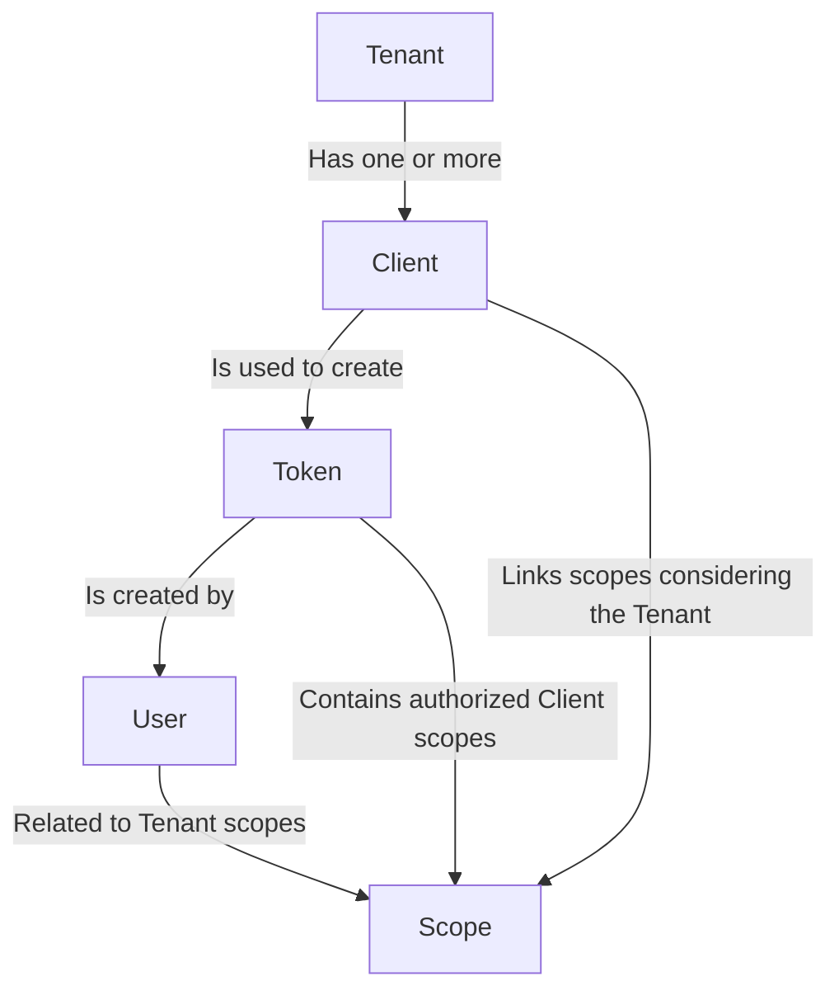
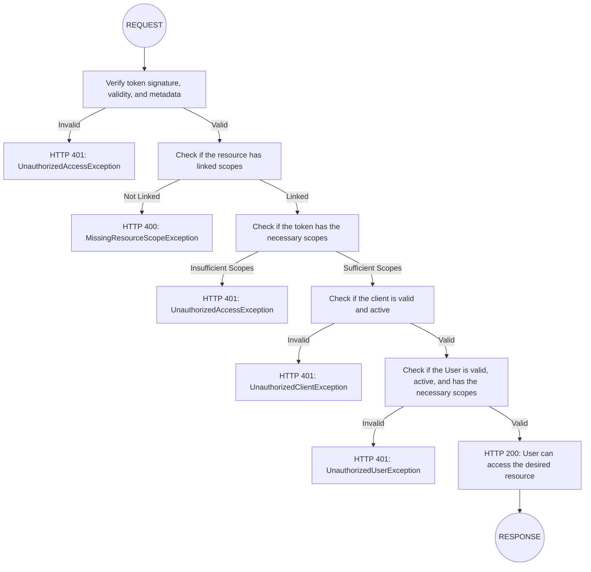

# hf-shield

A module for authentication and authorization management using OAuth 2.0, with robust support for
scope hierarchy and authentication flow.

## Table of Contents

1. [Introduction](#introduction)
2. [Installation](#installation)
3. [Configuration](#configuration)
4. [Translations](#translations)
5. [Defining Permissions](#defining-permissions)

---

## Introduction

**hf-shield** is a module designed to facilitate the implementation of authentication and scope-based access control.
It follows the guidelines of the OAuth 2.0 protocol and is especially useful for distributed systems, multi-tenant
applications, and APIs that require complex permission hierarchies.

With customizable flows and well-defined validations, **hf-shield** offers a secure and scalable way to ensure
access to resources, with validations focused on tokens, users, and clients.

## Installation

Make sure your project uses PHP 8.2 or higher to ensure full compatibility.

To start using **hf-shield**, we suggest first installing `hyperf/hyperf-skeleton`.

```shell
composer create-project hyperf/hyperf-skeleton my-project
```

During installation, accept the following packages:

- Redis client: `hyperf/redis`
- Config Center: option 3 ETCD
- AMQP Component `hyperf/amqp`
- Elasticsearch component `hyperf/elasticsearch`

After installation, navigate to the project directory and install this module:

```bash
cd my-project
composer require jot/hf-shield
```

---

## Configuration

After installing the module, it needs to be configured. Make sure all dependencies are installed in your environment
before starting the service.

You can set up your development environment using the [docker-composer](./docker-compose.yml) in this
repository.

### Dependencies

#### ETCD

After installing the service in your environment, run the command below:

```shell
php bin/hyperf.php vendor:publish hyperf/etcd
```

#### REDIS

All cache management and rate-limiting are stored in Redis. After installing the service, run the command below:

```shell
php bin/hyperf.php vendor:publish hyperf/redis
```

With the configuration created, publish the credentials to ETCD with the following command:

```shell
php bin/hyperf.php etcd:put redis
``` 

#### ELASTICSEARCH

This application was built to use Elasticsearch as the main database.

```shell
php bin/hyperf.php vendor:publish jot/hf-elastic
```

After editing the `.env` file with the necessary credentials, register them in etcd:

```shell
php bin/hyperf.php etcd:put hf_elastic
``` 

#### SWAGGER

The code generation commands provided by the `jot/hf-repository` module already create controllers, entities, and
data repositories with the necessary Swagger basics, which means the application is born with documented APIs.

```shell
php bin/hyperf.php vendor:publish jot/hf-repository
```

#### RATE-LIMIT

Like Swagger, the `jot/hf-repository` module also implements the application's throttling configuration, which
can be configured globally and reimplemented on a case-by-case basis in controller methods through their
_annotations_.

```shell
php bin/hyperf.php vendor:publish hyperf/rate-limit
```

#### OAUTH2

Finally, add the configurations for this module to work:

```shell
php bin/hyperf.php vendor:publish jot/hf-shield
```

**Example of `config/autoload/hf_shield.php`:**

```php
return [
    'token_format' => 'JWT',            // token format. By default, JWT
    'private_key' => '',                // path or content of the private key
    'public_key' => '',                 // path or content of the public key
    'encryption_key' => '',             // string for data encryption
    'token_days' => 'P1D',              // token validity in PHP DateTimeInterval format
    'refresh_token_days' => 'P1M',      // refresh token validity in PHP DateTimeInterval format
    'revoke_user_old_tokens' => true,   // enables trigger that revokes previous user/client tokens
];
```

#### MIGRATIONS

After everything is configured, it's time to run the migrations so that the necessary indices for the authentication
process are created:

```shell
php bin/hyperf.php elastic:migrate
```

---

## Translations

**hf-shield** supports internationalization (i18n) using the hyperf/translation package. Translation files are located
in `storage/languages/{locale}/hf-shield.php`.

Currently, the module supports the following languages:

- English (en)
- Brazilian Portuguese (pt_BR)

To add support for a new language, create a new translation file following the existing pattern.

### Publishing Translations

Translations are automatically published when you run the package publish command:

```shell
php bin/hyperf.php vendor:publish jot/hf-shield 
```

Additional packages translations will be automatically published when you publish the `hf-*` package.

eg:

```shell
php bin/hyperf.php vendor:publish jot/hf-elastic 
php bin/hyperf.php vendor:publish jot/hf-validator 
php bin/hyperf.php vendor:publish jot/hf-repository 
```

### Customizing Translations

You can customize translations by editing the files in `storage/languages/{locale}/messages.php`. Translation keys are
organized into the following categories:

- Command messages (for CLI)
- Form labels and prompts
- Exception messages

---

## Defining Permissions

### Scopes

Scopes are automatically implemented in controllers when created by the repo:controller or repo:crud command,
but if you are implementing a controller manually, add the following docblock before the desired action:

```php
#[Scope(allow: 'service:resource:permission')]
public function myAction(string $id): PsrResponseInterface {
   // ...
}
```

#### Scope Naming Rules

Scopes should be named following this pattern: `[service]:[resource]:[permission]`

Examples:

```
api-events:event:list
api-events:event:create
api-shopping:order:create
api-shopping:order:update
api-shopping:order:list
```

To register the scopes in the application, run the command below:

```shell
php bin/hyperf.php oauth:scope sync
```

### Token Validation

If you want your action to be protected by token, you must add the middleware with the desired validation strategy:

```php
#[Middleware(middleware: BearerStragegy::class)]
```

Currently, there are 3 types of strategies for request validation:

1. **BearerStrategy**, validates the token through the Authorization header: Bearer _{token}_, generated by the `/oauth/token` endpoint.
2. **SessionStrategy**, validates the token from the access_token cookie, generated by the '/oauth/session' endpoint, which
   encrypts the token and sends it to the browser cookies.
3. **SignedJwtStrategy**, validates the token by its signature. In this case, the payload is sent in the JWT and validated by
   the user's signature.

---

### API Validation Scope Hierarchy

The following diagram describes how the scope hierarchy works in **hf-shield**:



### Authentication Flow

The authentication flow expected by **hf-shield** is described in the diagram below:



---


