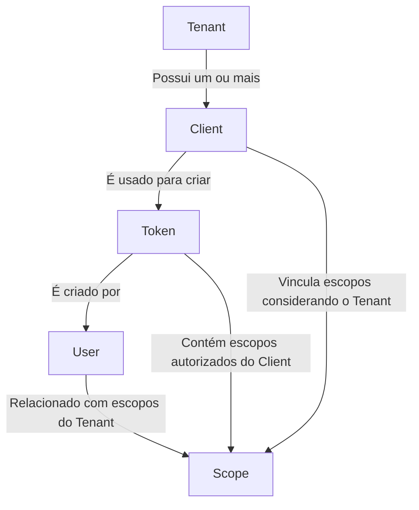
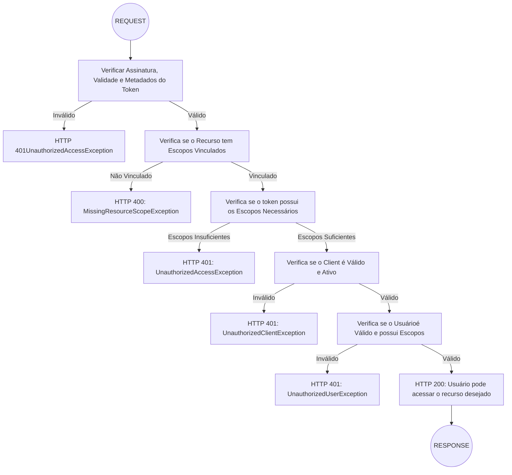

# hf-shield

Um módulo para gerenciamento e validação de autenticação e autorização utilizando OAuth 2.0, com suporte robusto para
hierarquia de escopos e fluxo de autenticação.

## Índice

1. [Introdução](#introdução)
2. [Instalação](#instalação)
3. [Configuração](#configuração)
4. [Definindo as permissões](#definindo-as-permissões)

---

## Introdução

O **hf-oauth2** é um módulo projetado para facilitar a implementação de autenticação e controle de acesso baseado em
escopos. Ele segue as diretrizes do protocolo OAuth 2.0 e é especialmente útil para sistemas distribuídos, multi-tenant
e APIs que demandam hierarquias complexas de permissões.

Com fluxos customizáveis e validações bem definidas, o **hf-oauth2** oferece uma maneira segura e escalável de garantir
o acesso a recursos, com validações focadas em tokens, usuários e clientes.

## Instalação

Certifique-se de que o seu projeto utiliza o PHP 8.2 ou superior para garantir a compatibilidade total.

Para começar a usar o **hf-oauth2**, sugerimos primeiro instalar o `hyperf/hyperf-skeleton`.

```shell
composer create-project hyperf/hyperf-skeleton my-project
```

Durante a instalação, aceitar os seguintes pacotes:

- Redis client: `hyperf/redis`
- Config Center: opção 3 ETCD
- AMQP Component `hyperf/amqp`
- Elasticsearch component `hyperf/elasticsearch`

Após a instalação, entre no diretório do projeto e instale este módulo:

```bash
cd my-project
composer require jot/hf-oauth2
```

---

## Configuração

Após instalar o módulo, é necessário configurá-lo. Verifique se todas as dependências estão instaladas em seu ambiente
antes de iniciar o serviço.

### Dependências

#### ETCD

Após instalação do serviço no seu ambiente, execute o comando abaixo:

```shell
php bin/hyperf.php vendor:publish hyperf/etcd
```

#### REDIS

Toda a gestão de cache e rate-limit são armazenadas no Redis. Após a instalação do serviço, execute o comando abaixo:

```shell
php bin/hyperf.php vendor:publish hyperf/redis
```

Com a configuração criada, publique as credenciais no ETCD com o seguinte comando:

```shell
php bin/hyperf.php etcd:put redis
``` 

#### ELASTICSEARCH

Esta aplicação foi construída para usar o Elasticsearch como base de dados principal.

```shell
php bin/hyperf.php vendor:publish jot/hf-elastic
```

Após editar o arquivo `config/autoload/hf_elastic.php` e inserir as credenciais do Elasticsearch, registre-as
no etcd:

```shell
php bin/hyperf.php etcd:put hf_elastic
``` 

#### SWAGGER

Os comandos de geração de código disponibilizados pelo módulo `jot/hf-repository` já criam controladores, entidades e
repositórios de dados com o básico necessário do Swagger, o que faz com que a aplicação já nasça com suas APIs
documentadas.

```shell
php bin/hyperf.php vendor:publish hyperf/swagger
```

#### RATE-LIMIT

Assim como o swagger, o módulo `jot/hf-repository` também implementa a configuração de _throttling_ da aplicação, que
pode ser configurada globalmente e reimplementada caso a caso nos métodos dos controladores por meio de suas
_annotations_.

```shell
php bin/hyperf.php vendor:publish hyperf/rate-limit
```

#### OAUTH2

E por fim, adicione as configurações para o funcionamento deste módulo:

```shell
php bin/hyperf.php vendor:publish jot/hf-oauth2
```

**Exemplo de `config/autoload/hf_oauth2.php`:**

```php
return [
    'token_format' => 'JWT',            // formato do token. Por padrão, JWT
    'private_key' => '',                // path ou conteúdo da chave privada
    'public_key' => '',                 // path ou conteúdo da chave pública 
    'encryption_key' => '',             // string para criptografia dos dados
    'token_days' => 'P1D',              // validade do token no padrão DateTimeInterval do php
    'refresh_token_days' => 'P1M',      // validade do refresh token no padrão DateTimeInterval do php
    'revoke_user_old_tokens' => true,   // habilita gatilho que revoga os tokens anteriores do usuário/cliente
];
```

#### MIGRATIONS

Depois de tudo configurado, é hora de executar as migrations para que os índices necessários para o processo de
autenticação sejam criados:

```shell
php bin/hyperf.php elastic:migrate
```

---

## Definindo as permissões

---

### Hierarquia dos escopos de validação da API

O diagrama a seguir descreve como a hierarquia de escopos funciona no **hf-oauth2**:



### Regras de nomenclatura dos escopos

Os escopos devem ser nomeados seguindo o seguinte padrão: `[serviço]:[recurso]:[permissão]`

Exemplos:

```
api-events:event:list
api-events:event:create
api-shopping:order:create
api-shopping:order:update
api-shopping:order:list
```

### Fluxo de autenticação

O fluxo de autenticação esperado pelo **hf-oauth2** é descrito no diagrama abaixo:



---


