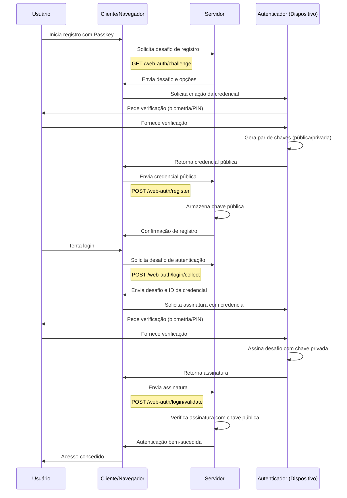

# Fluxo de autenticação por Webauthn (passkey)

```mermaid
sequenceDiagram
    participant U as Usuário
    participant C as Cliente/Navegador
    participant S as Servidor
    participant A as Autenticador (Dispositivo)
    
    %% Registro
    U->>C: Inicia registro com Passkey
    C->>S: Solicita desafio de registro
    Note right of C: GET /web-auth/challenge
    S->>C: Envia desafio e opções
    C->>A: Solicita criação da credencial
    A->>U: Pede verificação (biometria/PIN)
    U->>A: Fornece verificação
    A->>A: Gera par de chaves (pública/privada)
    A->>C: Retorna credencial pública
    C->>S: Envia credencial pública
    Note right of C: POST /web-auth/register
    S->>S: Armazena chave pública
    S->>C: Confirmação de registro
    
    %% Autenticação
    U->>C: Tenta login
    C->>S: Solicita desafio de autenticação
    Note right of C: POST /web-auth/login/collect
    S->>C: Envia desafio e ID da credencial
    C->>A: Solicita assinatura com credencial
    A->>U: Pede verificação (biometria/PIN)
    U->>A: Fornece verificação
    A->>A: Assina desafio com chave privada
    A->>C: Retorna assinatura
    C->>S: Envia assinatura
    Note right of C: POST /web-auth/login/validate
    S->>S: Verifica assinatura com chave pública
    S->>C: Autenticação bem-sucedida
    C->>U: Acesso concedido
```